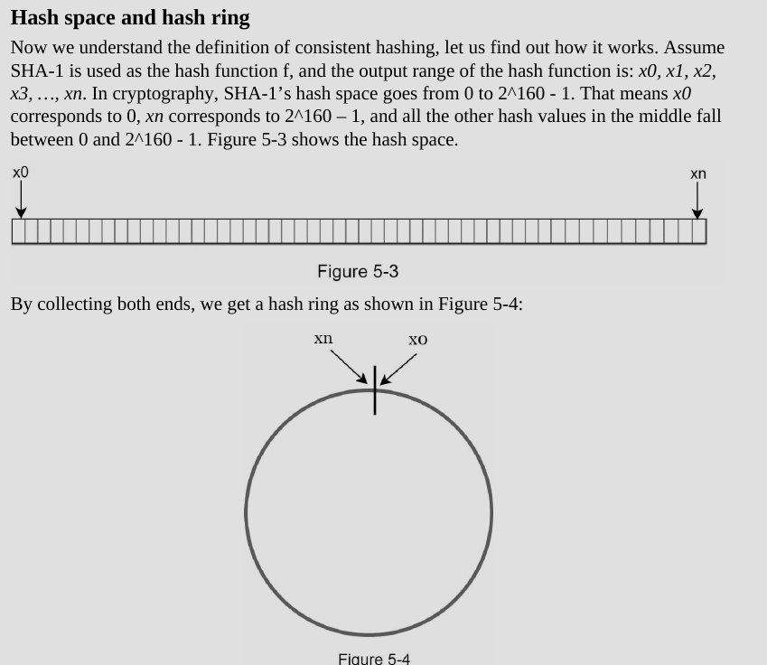
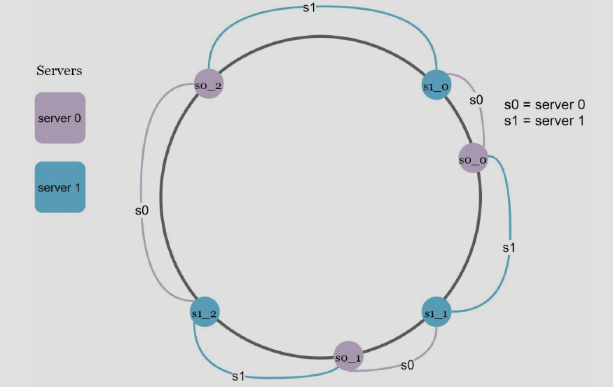

# Theory

## definition
1. Consistent hashing is a special kind of hashing such that when a
hash table is re-sized and consistent hashing is used, only `k/n` keys need to be remapped on
average, where k is the number of keys, and n is the number of slots. In contrast, in most
traditional hash tables, a change in the number of array slots causes nearly all keys to be
remapped [1]

## hash space and ring

## hash keys
- different function , there is no modular operation
## server look up
- clock wise from the key position on the ring until a server is found
## add a server
- require distribution of a fraction of keys
## remove a server
- only a small fraction of keys require redistribution with consistent hashing

## issues with basic approach
1. process
  2.  Map servers and keys on to the ring using a uniformly distributed hash function.
  3. To find out which server a key is mapped to, go clockwise from the key position until the
  first server on the ring is found.
2. parition: hash space between adjacent servers
  3. impossible to keep the same size of partitions on the ring for all servers, considering the servers can be added or removed
4. possible to have non-uniform key distribution on the ring
  5. `solution: virtual nodes or replicas is used to solve these problems`

## virtual nodes
- virtual nodes refer to real node
- each server is represented by multiple virtual nodes on the ring
- with virutal nodes each server is responsible for multiple partitions
- paritions with label s0 -> are managed by server 0
- to find which server a key is stored on 
  - we go clockwise from the key's location and find the first virtual node encountered in the ring
- `as number of virtual nodes increases, the distribution of keys becomes more balanced`

## find affected keys
-  server 4 is added onto the ring. The affected range starts from s4 (newly
added node) and moves anticlockwise around the ring until a server is found (s3). Thus, keys
located between s3 and s4 need to be redistributed to s4.
- When a server (s1) is removed as shown in Figure 5-15, the affected range starts from s1
(removed node) and moves anticlockwise around the ring until a server is found (s0). Thus,
keys located between s0 and s1 must be redistributed to s2.

# Notes from [Consistent Hashing- Tome White](https://tom-e-white.com/2007/11/consistent-hashing.html)

## what and why

- If you have a collection of n cache machines then a common way of load balancing across them is to put object o in cache machine number hash(o) mod n.
- This works well until you add or remove cache machines (for whatever reason), for then n changes and every object is hashed to a new location.
- This can be catastrophic since the originating content servers are swamped with requests from the cache machines. It's as if the cache suddenly disappeared. Which it has, in a sense. (This is why you should care - consistent hashing is needed to avoid swamping your servers!)

## expected

- it would be nice if, when a cache machine was added, it took its fair share of objects from all the other cache machines. Equally, when a cache machine was removed, it would be nice if its objects were shared between the remaining machines. This is exactly what consistent hashing does - consistently maps objects to the same cache machine, as far as is possible, at least.

## explanation
- `The basic idea behind the consistent hashing algorithm is to hash both objects and caches using the same hash function.`
- The reason to do this is to map the cache to an interval, which will contain a number of object hashes
- If the cache is removed then its interval is taken over by a cache with an adjacent interval. All the other caches remain unchanged.

# Implementation notes

> ring is not about nodes, it about positions (hashes)

## what are we building
- a simple cli working with consistent hashing
