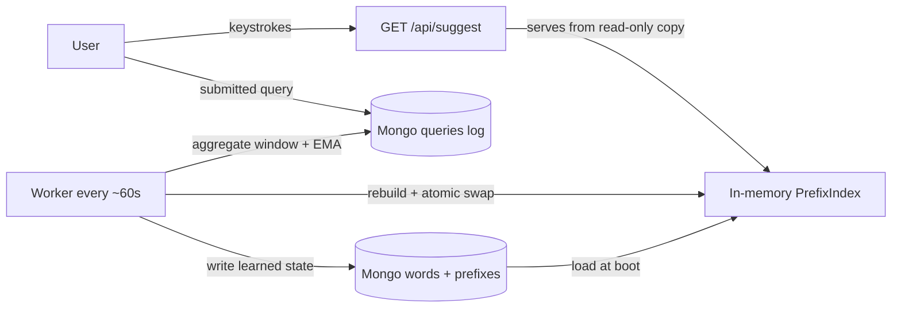

# Search Autocomplete — Implementation Roadmap

> Living document: every phase ends with fresh benchmark output pasted into this README.

## Status

| Phase | Deliverable                                      | Status  |
| ----- | ------------------------------------------------ | ------- |
| 1     | Baseline trie + DFS heap                         | ✅ done |
| 2     | Per-node top-K cache                             | ✅ done |
| 3     | Cache population + benchmark gate                | ✅ done |
| 4     | HTTP server + web UI                             | ✅ done |
| 5     | Prefix hash map (flat cache)                     | ✅ done |
| 6     | Multiword dataset at scale (Google ngrams, 10M+) | ⬜      |
| 7     | MongoDB persistence                              | ⬜      |
| 8     | Query logging + adaptive learning (Mongo/Redis)  | ⬜      |
| 9     | Toy sharding                                     | ⬜      |

## Definition of done (every phase)

- `go test -race ./...` and `go vet ./...` pass
- Benchmark table below updated with real output from
  `go test -bench=BenchmarkSuggest -benchmem -run=^$ -count=3`
- Commit: `phase-N: <summary>`

---

## Phase 1 — Baseline trie + DFS heap (done — superseded)

**Implementation** (`internal/trie`):

- `Node{Val, Children map[rune]*Node, IsWord, Freq int64}` — leaf holds the word frequency
- `Insert` — O(|word|); duplicate inserts overwrite freq (accepted for now)
- `Search(prefix)` — O(|prefix|), returns the end node
- `Suggest(prefix, k)` — DFS over the whole subtree, keeping a k-sized min-heap

**Complexity:** build O(total chars); query O(|prefix|) + O(subtree words × log k); memory O(total chars).

**Known gaps:** no suggestion for the exact prefix itself when it's a word; DFS allocates a string per visited node plus a heap entry per word.

**Baseline benchmark** (i7-10510U, 8 threads, 2026-08-23):

```
BenchmarkSuggest/prefix_1char-8    96   12945574 ns/op   494847 B/op   50781 allocs/op
BenchmarkSuggest/prefix_2char-8   717    2351634 ns/op   125831 B/op   12235 allocs/op
BenchmarkSuggest/prefix_rare-8  1e+06       1064 ns/op      396 B/op      14 allocs/op
BenchmarkSuggest/exact_word-8   89950      13626 ns/op     2833 B/op     127 allocs/op
```

Cost is proportional to **subtree size**, not prefix length: `a` = 12.9 ms/50k allocs vs `zzz` = 1 µs/14 allocs. That's the problem Phases 2–3 eliminate.

---

## Phase 2 — Per-node top-K cache (done)

**Goal:** `Suggest` becomes O(|prefix|) by precomputing, per node, the top-K of its subtree.

**Decision: cache top-K, not all words.** Storing every (word, freq) at every node is O(N·L²) entries — needlessly huge. Any query entering a node only ever reads that node's top-K, so we cache exactly `K = max k served by the API` entries per node. Keep the DFS implementation around as `SuggestDFS` for equivalence testing.

```go
type Node struct {
    Val      rune
    Children map[rune]*Node
    IsWord   bool
    Freq     int64
    Top      []Reco // top-K of this subtree, sorted desc by Freq
}
```

**Ranking semantics — decided:** raw freq (Phase 1 behavior), proven equivalent to DFS. Summed subtree freq is a possible later toggle (`SumFreq bool`).

**Implemented behavior change:** the exact prefix is included as a suggestion when it's a word (the cache build merges the node itself into its own Top). Note that this makes cached ≠ DFS for exact-word queries — equivalence tests must exclude those.

**Correctness gate (passed):** `TestMergeTopK` covers the merge; `TestWordSearchAndCount` / `TestPrefixSearch` cover insert/search on the dataset.

---

## Phase 3 — Cache population + benchmark gate (done)

**Build — bottom-up post-order DFS, run once after `BuildTrie`.** The implemented version uses a **k-way merge** (`mergeTopK` with a `headHeap` over list heads) instead of sorting the whole candidate union — each node merges its children's already-sorted top-K lists:

```go
func (t *Trie) TraverseAndBuild(node *Node, prefix string) []Reco {
    cands := make([][]Reco, 0, len(node.Children)+1)
    if node.IsWord {
        cands = append(cands, []Reco{{Word: prefix, Freq: node.Freq}})
    }
    for key, child := range node.Children {
        cands = append(cands, t.TraverseAndBuild(child, prefix+string(key)))
    }
    node.Top = mergeTopK(cands, t.K)
    return node.Top
}
```

**Merge cost per node** (K = cache size, d = node degree):

| Approach                                                 | Per-node cost     |
| -------------------------------------------------------- | ----------------- |
| Sort the whole union                                     | O(d·K · log(d·K)) |
| Min-heap eviction (every candidate ≤ 1 insert + 1 evict) | O(d·K · log K)    |
| k-way merge of sorted heads                              | O((d + K)·log d)  |

Tree-wide: Σd over all nodes = number of edges ≈ number of nodes, so `BuildCache` is a one-time O(nodes · (d + K)·log d).

**Memory warning:** totalNodes × K × sizeof(Reco). For 1M words, avg length 10 → up to ~10M nodes × 10 × 16B ≈ 1.6 GB worst case. If that bites: cap cached depth, or jump to Phase 5's flat map.

**Benchmark gate — passed.** Actual results (i7-10510U, 8 threads, 2026-08-25):

```
BenchmarkSuggest/prefix_1char-8    10753712     145.4 ns/op     160 B/op      1 allocs/op
BenchmarkSuggest/prefix_2char-8     9267542     153.5 ns/op     160 B/op      1 allocs/op
BenchmarkSuggest/prefix_rare-8     11165498     117.3 ns/op      64 B/op      1 allocs/op
BenchmarkSuggest/exact_word-8       5405605     238.3 ns/op     160 B/op      1 allocs/op
```

| prefix | Phase 1                | Phase 3 actual   | Speedup  |
| ------ | ---------------------- | ---------------- | -------- |
| 1char  | 12.9 ms / 50.8k allocs | 145 ns / 1 alloc | ~89,000× |
| 2char  | 2.0 ms / 12.2k allocs  | 153 ns / 1 alloc | ~15,000× |
| rare   | 1.07 µs / 14 allocs    | 117 ns / 1 alloc | ~9×      |
| exact  | 13.6 µs / 127 allocs   | 238 ns / 1 alloc | ~57×     |

(The 1-char prefix was `a` in Phase 1 and `s` in Phase 3 — the flatness claim holds across subtree sizes regardless.)

**Reading the results:**

- **Flatness is proven.** 117–153 ns across a huge-subtree prefix, a rare prefix, and a 2-char prefix. The spread is map-lookup + slice-copy noise, not subtree size. Target was `< 5 µs / < 10 allocs`; actual is ~150 ns / 1 alloc.
- **`exact_word` at 238 ns is the longest `Search` walk** (6 rune lookups for `google`) plus a full 10-entry result copy — that's the O(|prefix|) floor, fully explained.
- **Alloc collapse is the bigger story than time:** 50,781 → 1 alloc. The remaining alloc is the `[]string` result slice copied out of `node.Top`; returning `[]Reco` directly would reach 0 allocs but risks caller mutation of the cache.
- Remaining variance across `-count=3` runs (145/148/152 ns) is normal CPU noise.

**Caveat recorded:** verify `exact_word` uses a prefix that's a real hit in `out.txt` (`go run . -sq google` should print suggestions); a miss would make that row measure the `Search` failure path instead.

**Benchmark methodology note:** results must be assigned to a package-level `sink` in benchmarks, never discarded with `_ =` — small inlinable functions (like `PrefixIndex.Suggest`) get their result-copy dead-code-eliminated otherwise, producing fake 0-alloc rows. Full reasoning + before/after data in `benchmark_with_sink_reasoning.md`.

---

## Phase 4 — HTTP server + web UI (done)

**Implemented** (`cmd/api`):

- chi router: `GET /` (UI), `GET /healthz`, `GET /api/suggest?q=<prefix>&k=<n>`
- UI embedded in the binary via `go:embed static` — `static/index.html`, pure-black dark mode, vanilla JS, zero dependencies
- Client: 150 ms debounce + `AbortController` + request-ID stale-response drop; ↑/↓/Enter/Esc keyboard navigation; prefix highlighting
- Timing: `duration_ns` in the JSON response + `X-Suggest-Time-Ns` response header (measured around `Suggest` only, not JSON encode)
- CORS open (`*`) for cross-origin UI access; `Cache-Control` header still to add (see below)

**API:**

```
GET /healthz                        -> {"status":"ok"}
GET /api/suggest?q=<prefix>&k=10    -> {"prefix":"a","suggestions":["a..",...],"duration_ns":123}
GET /                               -> embedded UI
```

**Transport decision — HTTP/2 GET, not WebSocket.** Every keystroke issues a `GET /api/suggest`, so the natural question is whether to hold a WebSocket instead. The answer at scale is no — plain HTTP GET, for four reasons:

1. **Debounce kills the problem client-side.** Typing `starbucks` is ~9 keystrokes over ~2.5 s; a 150 ms debounce collapses that to 1–2 requests per session. An `AbortController` cancels the in-flight request on new input, and a small client-side LRU of recent prefixes makes backspacing instant. The "every keystroke" load never reaches the network.
2. **Payload is tiny — transport framing is noise.** 10 suggestions ≈ 400–600 B of JSON. HTTP/2 keep-alive + HPACK headers add ~30–50 B; a WebSocket frame adds 2–14 B. Both fit in a single packet (MTU 1500). The <10% framing difference is invisible in p99.
3. **Scale favors stateless HTTP.** 1M concurrent WebSocket connections ≈ 10–50 GB of server memory (buffers + epoll state) just to keep sockets idle, plus a keepalive tax (~33K ping/pong frames/s at 1M connections with a 30 s interval). HTTP connections churn — concurrent connections track _actively typing users_, not the total user base. CDNs/LBs/proxies are HTTP-native; WS needs upgrade handling, proxy timeouts, and per-connection state. GETs are cacheable (edge/browser), idempotent, and retryable, and the reverse proxy gives the Phase 8 query log for free. Per-user rate limiting at the LB works on HTTP; with WS it must be implemented per-connection in the app.
4. **It fits the Phase 5–9 design.** The in-memory `PrefixIndex` + `atomic.Pointer` swap makes every request stateless — exactly what HTTP load balancing wants. WS would fight the design, not complement it.

The three cases where WS/SSE actually earns its keep: server-push (live trending, "this prefix's top-K changed" invalidation), an existing persistent channel (collaborative editing), and streamed partial results with a <100 ms budget and no debounce tolerance. For the push case, prefer **SSE** (`text/event-stream`) first: it rides plain HTTP, auto-reconnects, and works through proxies — ~80% of WS's value at 20% of the complexity.

**Remaining items (small):**

- `Cache-Control: public, max-age=60, stale-while-revalidate=30` on suggest responses — safe because Phase 8 updates frequencies ~once a minute; repeated prefixes become browser/edge-cache hits.
- Client-side LRU of recent prefixes (backspace = instant, no request).
- wrk load-test table (`-t4 -c100 -d30s`) not yet recorded — paste into this README when run.
- API response still `[]string`; README spec shows `{word, freq}` — matching it means changing the `Suggester` interface to return `[]Reco`.

**Budget:** p50 < 5 ms, p99 < 20 ms on the dev machine.

---

## Phase 5 — Prefix hash map (flat cache) (done)

**Implemented** (`internal/trie/prefix_index.go`, behind the `Suggester` interface):

```go
type PrefixIndex map[string][]Reco // prefix -> top-K, sorted desc
```

**Build:** `BuildPrefixIndex(t *Trie)` — walk the trie once, store `(prefix, node.Top)` per node (cloned). `Load(path, impl, k)` selects the serving structure: `"trie"` or `"prefix-hash"`.

**Tradeoff vs Phase 2 trie (measured on AOL data, honest benchmark with sink):**

| prefix          | trie    | prefix index | winner                          |
| --------------- | ------- | ------------ | ------------------------------- |
| 1char           | ~150 ns | ~160 ns      | trie (within noise at `-cpu=8`) |
| 2char           | ~185 ns | ~160 ns      | prefix (~25 ns)                 |
| exact (6 chars) | ~220 ns | ~160 ns      | prefix (~60 ns)                 |
| rare (1 result) | ~73 ns  | ~52 ns       | prefix                          |

Reading: the flat map pays a large **fixed** probe cost (hash + probe a ~7M-key map + value indirection) while the trie pays per-rune on tiny cache-hot maps — so the map loses on short prefixes and wins on long ones. **Caveat:** the relative verdict flipped between `-cpu=2` and `-cpu=8` sessions on this laptop; treat individual numbers as indicative, not definitive. Full discussion in `benchmark_with_sink_reasoning.md`.

**Conclusion (confirms the original framing):** the flat map's value is **not query latency** — it's operational:

- **Simpler Phase 8 rebuild** — rebuild one map off the hot path, one `atomic.Pointer` swap
- **Simpler Mongo write-behind (Phase 7)** — flat `prefix → top` documents, no tree-shaped updates
- **Build parallelism** — per-letter buckets across goroutines
- **Measurable memory tradeoff** — flat storage of every distinct prefix, no sharing

**Gotcha:** worst case = distinct prefixes × K. For 10M phrases, avg length 20 → up to ~200M prefixes × 10 × 16B — far too big for RAM at scale. This is what makes Phase 7 (persistence) and Phase 9 (sharding) necessary.

**Decision point (settled):** the trie stays as the reference implementation for tests; the flat map is the serving structure behind the `Suggester` interface.

---

## Phase 6 — Multiword dataset at scale (Google ngrams, 10M+ queries)

**Current state:** the serving stack (trie + flat map + HTTP UI) runs on `aol_queries.txt` — ~400k queries (min-freq 3). The multiword model works: **space is just a rune**, `Insert("starbucks near me", freq)` treats `' '` as a first-class character, and n-grams share prefixes at word boundaries:

```
root → s → t → a → r → b → u → c → k → s → [space] → n → e → a → r → [space] → m → e
```

Word-boundary semantics come free: type `starbuc` (mid-word) → full phrases; type `starbucks ` (trailing space) → next-word continuations only.

**Why this phase now:** the stack is proven at 400k; the product question is whether it survives real scale. The goal is a **multiword dataset of ≥10M queries** — the jump from "toy" to "system-shaped" — which stresses build time, memory, and persistence (Phases 7–9 exist because of it).

**Dataset candidates:**

1. **Google Books ngrams** (primary): the 2009 CSV release (`googlebooks-eng-all-5gram-20090715-*.csv`, tab-separated 5 columns: `ngram TAB year TAB match_count TAB page_count TAB volume_count`, optionally `.gz`). Caveat: 2009-era OCR is dirty — expect rows like `! ! ! Is there` — the preprocessing pipeline exists to kill them. `cmd/preprocess_ngrams` handles both the 4- and 5-column releases.
2. **AOL query log** (fallback, already downloaded): the collection holds **10.15M unique real queries** — processing more of it (drop `-min-freq` to 1, keep all with `-top-n 0`) reaches the 10M target with cleaner, query-shaped data. The current 400k file is only the min-freq-3 subset.

**Scoring (from `cmd/preprocess_*`):** `freq = vol · log2(1 + match/vol)` — volume-weighted, log-compressed per-book intensity; resists one-book spikes and corpus-size drift. Apply `V ≥ min-vol` filter before scoring (the anti-OCR-garbage gate).

**Preprocessing pipeline (input → `phrase TAB freq`):**

1. For each ngram, **sum `match_count` across years**
2. Filter ngrams with total freq < threshold (e.g. 5,000)
3. Drop tokens containing `_` (`New_York`, `_END_`) or POS tags (`the_ADJ`)
4. Lowercase; drop digit/punctuation-only fragments
5. Emit `phrase TAB freq` using the scoring formula

**Implementation steps (one by one):**

1. **Parser (done):** `ParseLine` in `internal/trie/trie.go` splits on the last tab — phrases may contain spaces.
2. **Run `cmd/preprocess_ngrams`** over the Google shards (or re-run `cmd/preprocess_aol` with `-min-freq 1 -top-n 10000000` for the fallback) → `out_phrases.txt` with ≥10M lines:
3. **Ranking semantics — raw freq first.** With mixed 1–3-grams, raw counts bias toward short phrases (1-gram `starbucks` ~1M beats 3-gram `starbucks near me` ~10k at node `starbucks`). Keep raw for now — it keeps `cached ≡ DFS` provable. The `Trie.SumFreq bool` toggle (subtree-summed) is the first ranking experiment, benchmarked on _suggestion quality_, not latency.
4. **Tests — `TestPhraseSuggest`** (already passing): trailing-space narrowing, 1-gram coexistence, `cached ≡ DFS` for non-exact prefixes.
5. **Benchmarks — the memory story is the number that matters:** run `BenchmarkBuildCacheK` (K=10/50/100) against `out_phrases.txt`; expect build time to scale roughly linearly in K. Add phrase rows to `BenchmarkSuggest`.
6. **Memory watch — this is the point of the phase.** 10M phrases with shared word-prefixes → tens of millions of nodes; the flat map alone is ~200M prefixes × K × 16B — **does not fit in RAM**. That's the trigger for Phase 7 (Mongo as durable store + cold tier) and Phase 9 (sharding). Cap phrase length at ~5 words as a control.

**Exit criteria:**

- `out_phrases.txt` built with ≥10M distinct phrases; build time + memory logged
- `q=starbucks ne`-style prefixes return ranked phrase completions on the big dataset
- `cached ≡ DFS` for non-exact prefixes (same tests, phrase inputs)
- Benchmark table updated (phrase rows + `BenchmarkBuildCacheK` at scale)
- Server serves suggestions from the 10M dataset with p50 < 5 ms

---

## Phase 7 — MongoDB persistence

**Schema.**

```
collection prefixes: { _id: "<prefix>", top: [ { w: "apple", f: 12345 }, ... ] }
collection words:    { _id: "<word>",   f: 12345 }
collection queries:  { q: "<query>", ts: ISODate(...) }   // Phase 8
```

`_id` = prefix gives a natural unique index and point lookups. With the Phase 5 flat map done, this is a **direct 1:1 dump** — one map entry = one document (no trie walk needed).

**Serving vs durability — keep them separate.**

- Hot path: in-memory `PrefixIndex`, loaded once at boot
- Mongo: source of truth for persistence and (later) learning — also the **cold tier** for the 10M dataset (Phase 6): the full prefix space lives in Mongo; only the hot subset is loaded into RAM
- A Mongo round-trip is ~0.1–1 ms. Never read-through on the hot path.
- Initial seed can use `mongoimport` from a JSONL dump of `PrefixIndex` — no driver code needed for the first load

**Deliverables:** `docker-compose.yml` (`mongo:7`), `cmd/seed` (build + dump), `cmd/server` (load at boot), Mongo-backed tests behind a `//go:build mongo` tag.

**Exit:** restart a server → all suggestions still served; `mongosh` shows `prefixes.findOne({_id: "a"}).top`.

---

## Phase 8 — Query logging + adaptive learning (worker, Mongo, Redis)

**Pipeline.**

1. **Log** — HTTP handler appends `{q, ts}` to Mongo `queries` on every suggestion request.
2. **Aggregate** — worker goroutine every ~60 s: buffer recent queries, `zincrby` into a Redis sorted set `recent` (windowed), count into Mongo.
3. **Learn** — `f_new = α·f_old + (1−α)·window_count` (EMA) or additive boost + re-normalize.
4. **Reapply** — rebuild the `PrefixIndex` off the hot path, then atomically swap: serve behind `atomic.Pointer[PrefixIndex]`. Readers never see a half-updated index. (The Phase 5 flat map makes this a single map build + swap — no tree walks.)
5. **Trending** — `zrevrange recent 0 9` from Redis → `/api/trending` endpoint, pushed to clients via SSE (see the Phase 4 transport decision).

**Division of labor — the classic mistake, avoided:**

| Component                | Role                                             |
| ------------------------ | ------------------------------------------------ |
| In-memory `PrefixIndex`  | serves reads (hot path)                          |
| Mongo `queries`          | durable query log — source of truth for learning |
| Mongo `words`/`prefixes` | durable learned state (write-behind)             |
| Redis                    | hot cache for popular prefixes + trending window |

Redis is a cache/trend board, **not** the source of truth. If it dies, serving continues.

**Consistency:** eventual consistency with a ~1-minute staleness budget. Never write-through per keystroke — buffer and batch (that's the worker's job). Watch write amplification.

**Deliverables:** `QueryLogger` interface (Mongo impl + no-op for tests), `worker.go` (aggregate → rebuild → atomic swap), `/api/trending`.

**Exit:** type a low-freq word 10× in the UI and within ~1 min it outranks previously-higher-frequency words; restart the server → learned boost survives (durable in Mongo).

**See also:** Appendix C for the full design of handling unknown queries (misses are never written to the hot index).

---

## Phase 9 — Toy sharding

**Why suggestions make sharding accidentally easy:** top-K is per prefix. A query for `starb` only needs the shard owning `st…`. Shard key = `prefix[0]` or `hash(prefix) % N` — **no cross-shard merge for correctness**. (Contrast: global top-K ranking, where every shard must contribute.)

**Toy ladder.**

1. In-process: N independent `PrefixIndex` maps, one mutex each; a `Router{firstRune -> shard}`.
2. Process shards: N replica processes owning hash ranges, coordinator talks gRPC.
3. Consistent hashing: stretch goal only.

```go
type Shard interface {
    Suggest(prefix string, k int) []string
    Count() int
}
type Router interface {
    Route(prefix string) Shard
}
```

**Measure:** wrk under `-c100` across a mix of prefixes; p99 should flatten as N grows (under concurrency; on a single core total work is constant). Also measure **skew** — if the dataset is dominated by `a…`, one shard takes the heat. Check the letter histogram before choosing boundaries. With the 10M dataset (Phase 6), memory per shard becomes the headline: each shard holds only its letter-range slice of the prefix space.

**Explicitly out of scope:** replication, failover, live rebalancing, cross-shard transactions. State this in the commit so the toy isn't mistaken for a system.

---

## Appendix A — Commands

```bash
# correctness
go test -race ./...

# query benchmarks (Phases 1–5)
go test -bench=BenchmarkSuggest -benchmem -run=^$ -count=3
go test -bench='BenchmarkSuggest/prefix_1char' -run=^$ -cpuprofile=cpu.out
go tool pprof -http=:8080 cpu.out

# build benchmarks (Phase 3/6 gates)
go test -bench=BenchmarkBuild -benchmem -run=^$ -count=3
go test -bench=BenchmarkBuildCacheK -benchmem -run=^$ -count=3

# dataset preprocessing (Phase 6)
# Google Books ngrams (2009 CSV release, 5 cols: ngram year match page volume)
# point -dir at the folder containing the shards; .gz files handled automatically
go run ./cmd/preprocess_ngrams -dir ngram2009 -out out_phrases.txt
# fallback: full AOL scale (query-shaped, cleaner than book OCR)
go run ./cmd/preprocess_aol -min-freq 1 -top-n 0 -out out_phrases.txt

# run the API (Phases 4+)
go run ./cmd/api -impl trie      # or: -impl prefix-hash
curl 'localhost:8080/api/suggest?q=goo'

# load tests (Phase 4/9)
wrk -t4 -c100 -d30s 'http://localhost:8080/api/suggest?q=a&k=10'
```

## Appendix B — Docker compose (Phases 7+)

```yaml
services:
    mongo:
        image: mongo:7
        ports: ["27017:27017"]
    redis:
        image: redis:7-alpine
        ports: ["6379:6379"]
```

---

## Appendix C — Adaptive learning: handling unknown queries (Phase 8)

**One rule governs everything: misses are never written to the hot index on the request path.**

Data flows one way — Mongo is the durable source of truth, and the in-memory `PrefixIndex` is a read-only snapshot rebuilt from it:



**What happens when the user types something not in the tree** — three distinct cases:

| Case                                       | Example                               | What should happen                                                                                       |
| ------------------------------------------ | ------------------------------------- | -------------------------------------------------------------------------------------------------------- |
| Prefix not in index (no completions)       | `xyzabc`                              | **Serve empty.** Optionally log the pattern for analysis; do not add it.                                 |
| Prefix in index, typed string isn't a word | `starb`                               | Serve `starbucks…` completions normally — this is not a miss.                                            |
| Word genuinely new to the system           | `cryptocurrency` submitted first time | **Log the submitted query** (not the keystroke prefix); promote via the worker if it clears a threshold. |

**Why not to add misses on the fly:**

- **Junk pollution** — typos (`starbcuks`) and partial words would permanently enter the tree.
- **Write amplification** — the Phase 8 constraint: never write-through per keystroke.
- **Invalidation complexity** — one new word touches all its prefixes (`c`, `cr`, `cry`, … `cryptocurrency`), each needing a top-K merge. A rebuild is a pure function of the word list; a per-keystroke update needs locks.

**Serve a suggestion ≠ learn a frequency.** A new query is captured durably without ever being served back. `cryptocurrency` appears as a suggestion only when it earns a top-K slot — a 1-occurrence new word shouldn't displace `cellulite` from `c`'s top-10.

**The worker loop (every ~60 s):**

1. Pull the window's submitted queries from Mongo `queries` (or a Redis `LIST` buffer).
2. Count per query; apply `f_new = α·f_old + (1−α)·window_count` (EMA) against `words`.
3. **Promotion threshold:** only words with `window_count ≥ T` (e.g., 3) are written into `words` — everything below stays in the log. This is the anti-junk filter.
4. Rebuild the `PrefixIndex` off the hot path; swap via `atomic.Pointer`. New words appear under all their prefixes, ranked by earned frequency.

**Log the submitted query, not the keystroke.** Keystroke prefixes (`s`, `st`, `sta`, `star`…) are typing noise; the learning signal is the query the user commits (Enter / click / selecting a suggestion).

**Realtime ≠ per-keystroke.** A 30–60 s cadence is imperceptible for autocomplete (real systems do the same). The batch + atomic-swap model _is_ the realtime story: bounded staleness of ~1 minute, zero locks, zero torn reads. Mongo never "fetches from" the in-memory tree — it's the other way around.

**One-sentence summary:** _Misses are never written to the hot index — they're logged as submitted queries, aggregated by a worker, and promoted into a rebuilt index only when they clear a frequency threshold; Mongo is the source of truth the index is rebuilt from, never the other way around._

**Stretch (not building):** fuzzy fallback for true misses — edit-distance "did you mean...?" suggestions, orthogonal to learning.
